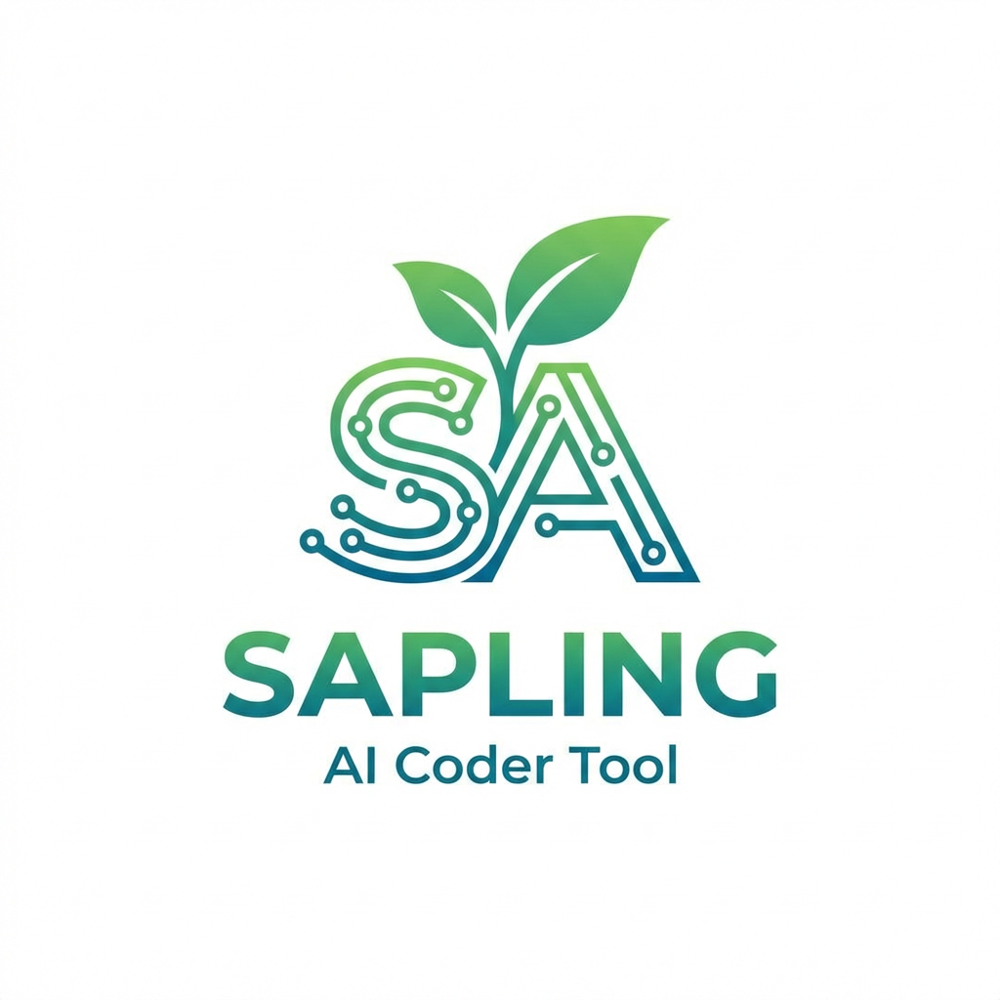

# Sapling

<p align="center">
  
</p>

AI-native MCP dev workbench: Postgres-backed knowledge store and typed work queue exposed to Claude Code (and other agents) via MCP.

See the [design spec](docs/superpowers/specs/2026-04-28-sapling-mcp-dev-workbench-design.md) for full rationale.

## Quickstart

```bash
cp .env.example .env
make up                       # postgres + mcp-server in docker
curl http://127.0.0.1:3333/health
```

Then install the Sapling Claude Code plugin (slash commands + MCP wiring in one step):

```text
/plugin marketplace add cfarvidson/sapling
/plugin install sapling@sapling
```

That gives you these `/sapling:<name>` slash commands:

- `/sapling:work` — pull next task and execute it
- `/sapling:plan <desc>` — enqueue a planning task
- `/sapling:enqueue <code|review> <desc>` — enqueue a code or review task
- `/sapling:status` — queue health
- `/sapling:human [<id>]` — list or answer work items paused on user questions (`awaiting_input`)
- `/sapling:queue [<work|plan> <id> [action]]` — inspect the queue and run lifecycle actions (activate, archive, update, replace, cancel, block, unblock, retry)
- `/sapling:rules [<service> | app <app-name>] [add|replace|remove|clear …]` — manage binding rules for an app or service
- `/sapling:context <service>` — load service context
- `/sapling:learn <app> [<path1> ...]` — research repos for an app; populate services, dependencies, and an architecture artifact

If you'd rather wire the MCP server up by hand instead of installing the plugin, point your client at the running server:

```json
{
  "mcpServers": {
    "sapling": { "type": "http", "url": "http://localhost:3333/mcp" }
  }
}
```

## Common commands

```bash
make up      # start (postgres + mcp-server)
make down    # stop (preserves data)
make logs    # tail mcp-server logs
make psql    # open a psql shell against the running container
make test    # run the test suite (vitest + testcontainers)
make nuke    # stop AND drop data volume + ./data/postgres (5s confirmation)
```

## Updating images & migrating

Migrations run automatically when `mcp-server` starts (`runMigrations` in `packages/mcp-server/src/index.ts`), so updating + migrating is one motion:

```bash
docker compose pull postgres        # refresh the postgres:16-alpine tag
docker compose build mcp-server     # rebuild the local mcp-server image (or: make build)
docker compose up -d                # recreate containers; migrations apply on startup
make logs                           # confirm "running migrations"
```

Notes:

- The `postgres` service is pinned to `postgres:16-alpine`. `pull` only refreshes that tag — it will not bump you to a new major version. For a major upgrade, dump first (`pg_dumpall`), bump the tag, then restore; the bind mount at `./data/postgres` is version-specific.
- `mcp-server` is built locally, so `pull` is a no-op for it — use `build` instead. Add `--no-cache` if dependencies aren't refreshing.
- Migrations are forward-only and idempotent: each `.sql` file in `packages/mcp-server/src/schema/` runs once, tracked in the `_migrations` table. To re-run on an already-built image, `docker compose restart mcp-server` is enough.
- Verify with `make psql` then `SELECT * FROM _migrations ORDER BY applied_at DESC;`.

## Optional auth

Set `MCP_TOKEN=...` in `.env` to require a bearer token on `/mcp`. Then update your client config:

```json
{
  "mcpServers": {
    "sapling": {
      "type": "http",
      "url": "http://localhost:3333/mcp",
      "headers": { "Authorization": "Bearer YOUR_TOKEN" }
    }
  }
}
```

## Layout

- `packages/mcp-server/` — Node/TypeScript MCP server (Streamable HTTP transport, 36 tools)
- `packages/claude-plugin/` — `.mcp.json` template + skills
- `packages/runner/` — `sapling-runner` daemon: polls the queue, spawns coding-agent subprocesses up to `max_concurrent`, reaps stuck claims each tick

## Autonomous mode

`sapling-runner` is a thin polling daemon that turns a Sapling queue into autonomous coding-agent runs. Each tick it reaps stuck claims, reads the runner config, and spawns up to `max_concurrent - running` agents via `bash -lc <agent_command>`. Each spawned agent self-claims via the existing `claim_next_work` MCP tool.

```bash
# Make sure mcp-server is up (`make up`).
make runner                            # foreground; SIGINT/SIGTERM = graceful shutdown
pnpm --filter sapling-runner dev -- --once          # one tick then exit
pnpm --filter sapling-runner dev -- --max-spawn 5   # exit after 5 spawns
```

The runner reads from `SAPLING_MCP_URL` (default `http://127.0.0.1:3333/mcp`) and `MCP_TOKEN` (optional). Tunable settings live in the `runner_config` singleton table and are read via `get_runner_config` at the start of each tick. Change them with the MCP `update_runner_config` tool:

```text
update_runner_config({ max_concurrent: 4 })
update_runner_config({ agent_command: "claude --dangerously-skip-permissions -p '/sapling:work'" })
update_runner_config({ poll_interval_ms: 15000 })   # requires runner restart
```

`agent_command` and `max_concurrent` take effect on the next tick. `poll_interval_ms` is read once at startup to arm the polling timer and requires a runner restart to apply.

Defaults: `max_concurrent=1`, `poll_interval_ms=30000`, `claim_ttl_ms=7200000` (2h), `max_claim_attempts=5`. Stuck claims older than `claim_ttl_ms` are reaped on the next tick (back to `pending`, or `failed` if `attempt_count` reached `max_claim_attempts`).

### Asking the user mid-plan

When an autonomous planning agent hits an ambiguity that would require guessing — unspecified API shapes, missing acceptance criteria, two reasonable approaches — it pauses the work item instead of producing a half-baked plan. The agent calls `request_human_input(work_id, questions_markdown)`, which atomically writes a `pending_questions` artifact and flips status from `claimed` to `awaiting_input`. The runner skips `awaiting_input` items, so the queue keeps moving.

Discoverability is **pull-based**: there are no outbound transports (no Slack webhook, no iMessage, no push). Run `/sapling:human` whenever you want to see what's waiting:

```text
/sapling:human            # list every awaiting_input item with its first question
/sapling:human <id>       # show the full questions and type your answers in-session
```

Submitting answers calls `provide_human_input`, which writes an `answers` artifact and flips status back to `pending`. The runner re-claims the item on the next tick; the next agent reads both artifacts (latest `pending_questions` + newer `answers`) before continuing planning. `/sapling:status` shows the `awaiting_input` count alongside the others, and `/sapling:queue work <id> retry` clears a paused item if the questions turn out to be wrong.

If you want proactive nudging, pair with `/loop`:

```text
/loop 30m /sapling:human
```

Tradeoff: pull-based means you have to check on your own cadence, but it removes every transport-flakiness failure mode (delivery, permissions, auth) that an outbound notifier would introduce. If proactive notification proves necessary, it ships as a separate phase later.

## Teams

A **team** lets one work item be executed by a coordinated lead + specialists instead of a solo agent. Teams are first-class rows: create them with `/sapling:teams`, optionally scope them to an app, and attach them to work items either explicitly or via per-(app, work_type) defaults.

```text
/sapling:teams                                  # list teams grouped by app
/sapling:teams create code-review               # interactive: lead prompt + roles
/sapling:teams set-default code code-review     # auto-attach to all new code items globally
/sapling:teams set-default code iris-code-review app iris  # per-app override
```

When the runner spawns `/sapling:work` for an item with `team_id`, the agent enters **lead mode**: it loads the team, prepends `lead_prompt_md` to its operating instructions, and dispatches specialists via Claude Code's `Agent` tool (with the role's `subagent_type` if pinned, else `general-purpose`). The lead remains the sole writer — specialists return text; the lead decides what gets committed.

A few invariants worth knowing:

- **Resolution is at enqueue time.** When you call `enqueue_work`, the server picks `team_id` once (explicit > per-app default > global default > null) and stores it on the row. Changing a default later does not retroactively reroute pending items.
- **`max_concurrent` semantics are unchanged.** A team is one process from the runner's point of view — the in-process specialists do not eat queue slots.
- **Solo mode is unchanged.** Items without `team_id` run exactly as they always have.
- **Deleting a team is non-destructive.** `work_items.team_id` is `ON DELETE SET NULL`, so referencing items revert to solo agent execution rather than failing.

See `docs/superpowers/specs/2026-04-29-agent-teams-design.md` for the full design rationale.

## Tests

Tests use [testcontainers](https://github.com/testcontainers/testcontainers-node) to spin up a real Postgres for integration tests. Docker must be running locally.

```bash
make test
```
