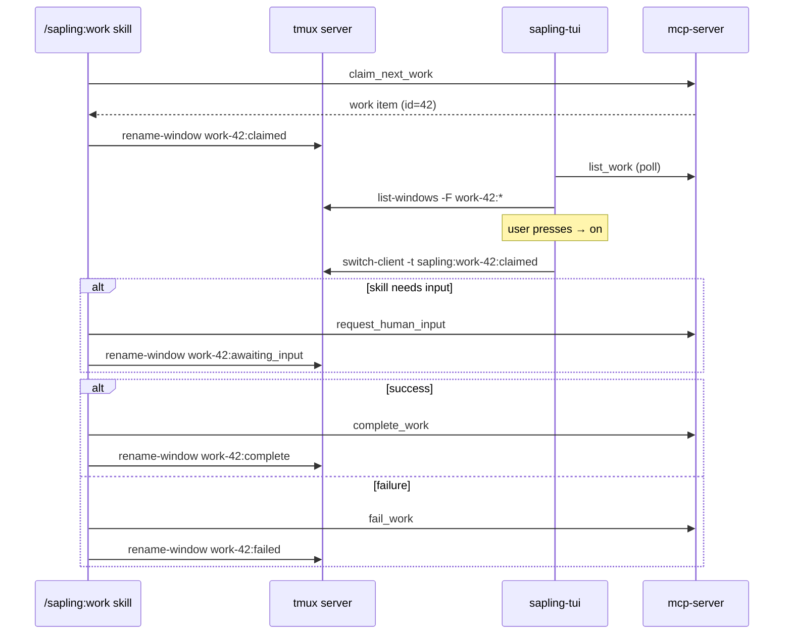

# feat: Sapling TUI — gap closure for PR #17

## Summary

PR #17 ships the first cut of the Sapling TUI (`packages/tui/`), the tmux-backed runner spawner, and the `make tui` Makefile target. The user reviewed the "remaining gaps" summary I produced and decided to close all of them in the same PR rather than ship phase 1 minus the gaps and follow up. This plan defines how to do that without re-opening the design questions PR #17 already resolved.

The work is opt-in additive: every change extends the existing PR's surface (TUI keys, mcp-client methods, skill renames, README, CI). No reverts of the PR's existing commits. One target branch, one PR; this plan landing means PR #17 reaches a state the user calls done.

## Problem Frame

PR #17 stopped at "smallest viable phase 1" because that was the shipping plan. The user wants the larger surface — discoverability, all action keys with reasons, filtering and help, plans/projects/schedules tabs, component tests, multi-runner safety, CI for live-tmux tests, and status-aware window names. Each gap is small or medium individually; together they are a non-trivial expansion. The risk is scope creep masquerading as "just gap closure" — particularly the new TUI tabs, which touch new MCP surface area and need real test coverage to land safely.

The non-negotiables from the user:

- Stay on branch `worktree-sapling-tui-design`. Amend the existing PR rather than opening another.
- Don't pretend to manually smoke-test `make tui` end-to-end — this background session has no TTY.
- Update `SPEC.md` for anything that touches the MCP surface, runner config, skill behavior, or runtime topology (CLAUDE.md rule).
- Bump plugin minor version if `/sapling:work` changes again (CLAUDE.md rule).
- Run `npx prettier --write` and `npm run lint -- --fix` on changed files before committing (CLAUDE.md rule).

---

## Scope

### In scope

- README mention of `make tui` and the TUI in general.
- `c` (cancel) prompts for a reason via `$EDITOR`. `r` (retry) prompts for an optional `after_ms` value via single-line capture. `u` (unblock) stays confirm-only — the `unblock_work` MCP tool takes no reason field, verified below.
- `/` filter (substring match on title and app) and `?` help overlay in the TUI.
- New top-level tabs in the TUI: `1` work (default, existing view), `2` plans, `3` projects, `4` schedules. Each reuses the existing two-pane layout.
- TUI component tests via `ink-testing-library`, a fake `McpClient`, and a fake tmux-windows function. Coverage on: status grouping, navigation cursor wrap behavior, attach gating, confirm modal, action key handling, tab switching, filter input, help overlay toggle.
- Multi-runner safety: at runner startup, list windows in the configured tmux session; emit a warning log when any `work-<n>` windows exist that this process did not spawn.
- GitHub Actions CI workflow that runs `pnpm install`, `npm run lint`, the runner test suite (with `$TMUX` set so the live-tmux integration tests fire), and the mcp-server test suite.
- Status-aware tmux window naming: the `/sapling:work` skill renames windows to `work-<id>:claimed` on claim, `work-<id>:awaiting_input` when calling `request_human_input`, `work-<id>:complete` after `complete_work`, and `work-<id>:failed` after `fail_work`. The TUI's `switchToWorkWindow` resolves by `work-<id>:*` prefix so the rename does not break attach.

### Deferred to follow-up work

- Live smoke test of `make tui` end-to-end (no TTY available in this session). Surfaced in the PR description as a manual-validation checklist for the user before merging.
- Multi-runner stronger safety (e.g., per-runner session naming, lockfile). The warning is the minimum viable signal — anything beyond that is a phase-2 design question.
- Embedded markdown rendering in the artifact detail pane. PR #17 ships first-N-chars; richer rendering is its own project.
- Schedule mutation actions in the TUI (run-now, enable/disable). Schedule tab is read-only in this plan; mutation belongs in a follow-up because `run_schedule_now` involves the scheduler tick.
- Subagent dispatch tooling for the TUI (e.g., `t` to dispatch a specialist). Not in scope.

### Outside this product's identity

- Web UI / browser-based dashboard.
- Embedded PTY inside the TUI (rejected during PR #17 design — the doc explicitly chose tmux-multiplexer over PTY-in-Ink).
- Non-tmux multiplexer support (zellij, screen).
- Replacing or merging `/sapling:status` and the TUI. They coexist by design.

---

## Architecture Decisions

### KTD-1. `/sapling:work` owns window renames; TUI does not double-rename

The skill knows when meaningful status transitions happen (it is the agent making them). The TUI only observes via polling, with up to `POLL_MS` latency. Routing all renames through the skill keeps a single source of truth and avoids the TUI racing against the skill or the runner. The TUI's job is purely `switch-client`; it never calls `tmux rename-window`.

Trade-off: a status transition driven by an external actor (e.g., a manual `mcp__sapling__cancel_work` from another session) won't update the window name. That's acceptable — the cancel will close the window shortly anyway, and the user's primary signal is the TUI's status column, not the window name.

### KTD-2. Window name format: `work-<id>:<status>` (single colon)

Today the skill renames to `work-<id>`. The new format adds a single `:<status>` suffix. `tmux switch-client -t sapling:work-42:claimed` is valid tmux syntax (the session-name part is `sapling`, the window-name part is `work-42:claimed`). The TUI matches by the `work-<id>` prefix to find any matching window regardless of suffix.

Rejected: appending more context (elapsed time, attempt count) — adds churn and tmux would re-render the window name every tick. The suffix is set once per transition and stays.

### KTD-3. Tabs are read-only views over the same `flatOrder` mental model

The four tabs (work, plans, projects, schedules) share the same two-pane shape: a list grouped on the left, a detail panel on the right. The only differences are: (a) which MCP method fetches the data, (b) how items group (work groups by status, plans group by status too, projects group by status, schedules group by enabled/disabled), and (c) which actions are valid in each tab (phase 1: only the work tab has actions; plans/projects/schedules are read-only).

This means we factor a `TabView` abstraction that takes a fetcher, a grouper, and an action surface. Each tab plugs in different functions but reuses layout, cursor, polling cadence, and key handling.

### KTD-4. `?` help overlay is rendered above everything; filter is inline

`?` toggles a full-screen modal listing every key binding. `/` opens an inline single-line input at the bottom of the screen and applies a substring filter to the current tab's list. The two are different shapes deliberately: filter is on-while-typing (you need to see the list update); help is interruptive (you're stepping out to learn keys, the list can disappear).

### KTD-5. Multi-runner safety is a warning, not an enforcement

At startup, the runner does `tmux list-windows -t <session>` and warns when it finds `work-<n>` windows. It does NOT refuse to start, rename the session, or kill foreign windows. The cost of trampling in the single-user local case is acceptable; the cost of a runner that refuses to start when another runner is alive is much higher (frustrating, hard to debug). This is consistent with the runner's existing best-effort posture (e.g., `reap_stuck_claims` is conservative).

### KTD-6. CI runs tmux integration tests in a GitHub-hosted Ubuntu runner

Ubuntu runners have tmux pre-installed (or apt-installable). The job starts a tmux server with `tmux new-session -d -s ci-sapling` and exports `TMUX=<socket>:<session>:<window>` so the runner's tests pick up `$TMUX` and exercise the live spawner. The 2 currently-skipped tests in `packages/runner/test/spawn.test.ts` then run instead of being skipped.

---

## Output Structure

```
packages/
  mcp-client/
    src/index.ts                        (+listPlans, +listProjects, +listSchedules, +Plan/Project/Schedule types)
  tui/
    src/
      App.tsx                           (refactored: TabView abstraction, filter/help overlays, reason prompts)
      tabs/
        useTabState.ts                  (NEW: shared selection + polling hook per tab)
        WorkTab.tsx                     (NEW: extracted from App.tsx)
        PlansTab.tsx                    (NEW)
        ProjectsTab.tsx                 (NEW)
        SchedulesTab.tsx                (NEW)
      components/
        FilterInput.tsx                 (NEW)
        HelpOverlay.tsx                 (NEW)
        ConfirmModal.tsx                (NEW: extracted from App.tsx)
      tmux.ts                           (switchToWorkWindow resolves work-<id>:<suffix>)
    test/
      App.test.tsx                      (NEW)
      tabs/
        WorkTab.test.tsx                (NEW)
        PlansTab.test.tsx               (NEW)
      helpers/
        fake-mcp.ts                     (NEW: in-memory McpClient)
        fake-tmux.ts                    (NEW: settable window list)
  runner/
    src/
      index.ts                          (+ startup multi-runner warning)
  claude-plugin/
    skills/work/SKILL.md                (rename at claim/awaiting_input/complete/failed)
    .claude-plugin/plugin.json          (0.13.0 -> 0.14.0)

.github/
  workflows/
    ci.yml                              (NEW: lint, test, tmux integration)

README.md                               (+ `make tui` section)
SPEC.md                                 (+ window-name format, + multi-runner warning, + new mcp-client surface)
```

---

## High-Level Technical Design

### TabView abstraction

The four tabs all need: a list of items, a way to group them, a selection cursor, a debounced detail fetch, a polling loop, and the ability to filter and switch. Today this logic lives directly in `App.tsx` keyed on `WorkItemDetail`. The deepening here is to make `App.tsx` a thin shell that picks the active tab and feeds it shared state.

Directional sketch (illustrative, not implementation):

```ts
// useTabState.ts — extracted, generic
function useTabState<T extends { id: number }>(opts: {
  fetch: () => Promise<T[]>,
  groupBy: (items: T[]) => Map<string, T[]>,
  groupOrder: readonly string[],
  intervalMs: number,
}): { items: T[]; grouped: Map<string, T[]>; flatOrder: number[]; selectedId: number | null; … }

// App.tsx
const tab = useActiveTab();   // 'work' | 'plans' | 'projects' | 'schedules'
return <Layout footer={<KeyHints />}>
  {tab === 'work'      && <WorkTab mcp={mcp} sessionName={sessionName} filter={filter}/>}
  {tab === 'plans'     && <PlansTab mcp={mcp} filter={filter}/>}
  {tab === 'projects'  && <ProjectsTab mcp={mcp} filter={filter}/>}
  {tab === 'schedules' && <SchedulesTab mcp={mcp} filter={filter}/>}
  {showHelp  && <HelpOverlay/>}
  {filterOn && <FilterInput value={filter} onChange={setFilter}/>}
</Layout>
```

This is directional — the implementing agent should treat hook shape, prop list, and naming as suggestions, not contract.

### Status-aware window naming flow



---

## Implementation Units

### U1. README mention of `make tui` and the TUI

**Goal.** New section in `README.md` that tells someone the TUI exists, what it does, and how to launch it.

**Requirements.** Gap #1 from the user list.

**Dependencies.** None.

**Files.**

- `README.md`

**Approach.** Add a level-2 section titled `## Live dashboard (TUI)` near the existing "make runner" / quickstart content. Include: one-paragraph description, a 5-7 line block showing `make tui` and what windows it opens, and a line about the keybindings (point at `?` for the help overlay). No screenshots (we can't generate them from this session); link to `docs/superpowers/specs/2026-05-16-sapling-tui-design.md` for the design.

**Patterns to follow.** Match the existing README tone and structure. Keep the section tight — the README is already 16K.

**Test scenarios.** `Test expectation: none — documentation-only change.`

**Verification.** Section renders cleanly in GitHub's markdown preview; references the right `make` target; links resolve.

---

### U2. `c` (cancel) prompts for reason via `$EDITOR`

**Goal.** Pressing `c` on a selected work item opens `$EDITOR` so the user can write a multi-line reason. Submitting the editor with a non-empty body calls `cancelWork(id, reason)`. Empty body cancels the action.

**Requirements.** Gap #2 (cancel-with-reason). `cancel_work` accepts `{ id, reason? }` per `packages/mcp-server/src/tools/work.ts`.

**Dependencies.** None.

**Files.**

- `packages/tui/src/App.tsx` (or its successor after the U5 refactor)
- `packages/tui/test/App.test.tsx`

**Approach.** Reuse `openEditor(initial)` from `packages/tui/src/editor.ts`. The flow mirrors the existing `i` (provide_human_input) path: drop raw mode, open editor, restore raw mode, call MCP. Replace the confirm modal for `c` with the editor flow. The confirm modal still exists for `u` (no reason needed) and is no longer used for `c`.

**Patterns to follow.** Existing `provide_human_input` flow in `App.tsx::runAction`.

**Test scenarios.**

- Pressing `c` with a selected item that is not in a terminal state invokes the editor with an empty initial buffer.
- Editor returns a non-empty string → `cancelWork` is called with `{ id, reason: <string> }`.
- Editor returns an empty string (cancelled) → `cancelWork` is NOT called; feedback bar shows "cancelled".
- After the call resolves, the pending state clears and the action-feedback line shows "cancelled #N".

**Verification.** Component test asserts the four scenarios; manual smoke (deferred) confirms a real `$EDITOR` invocation produces the expected MCP call.

---

### U3. `r` (retry) prompts for optional `after_ms`

**Goal.** Pressing `r` opens a single-line prompt asking "delay before retry in milliseconds? (blank = immediate)". Enter with blank input → `retryWork(id)`. Enter with a positive integer → `retryWork(id, afterMs)`. Esc cancels.

**Requirements.** Gap #2 (retry surfaces `after_ms`). `retry_work` accepts `{ id, after_ms? }`.

**Dependencies.** None.

**Files.**

- `packages/tui/src/App.tsx`
- `packages/tui/src/components/PromptInput.tsx` (NEW — small reusable single-line input; see U4 for the related `FilterInput`)
- `packages/tui/test/App.test.tsx`

**Approach.** Single-line input rendered inline at the bottom of the screen when the retry prompt is open. We don't need a third-party text-input library — Ink's `useInput` with a tiny stateful buffer is enough for digits-only. Validate on Enter: parse to integer, reject non-numeric (show inline error, keep prompt open), accept blank as "no delay".

**Patterns to follow.** Same useInput-driven state pattern as the existing confirm modal in `App.tsx`. The reusable component lets U4 share the same single-line input UX for the filter.

**Test scenarios.**

- Pressing `r` opens the prompt; the rest of the UI is dimmed/inactive.
- Typing digits and pressing Enter calls `retryWork(id, <number>)`.
- Pressing Enter with an empty buffer calls `retryWork(id)` (no `after_ms`).
- Typing non-digit characters is silently rejected (or accepted and shown but rejected at Enter, depending on simpler implementation).
- Pressing Esc closes the prompt without calling `retryWork`.

**Verification.** Component tests cover all five scenarios.

---

### U4. `/` filter + `?` help overlay

**Goal.** `/` opens an inline filter that does substring matching (case-insensitive) on title and app name (or analogous fields per tab). `?` toggles a full-screen help overlay listing every key binding.

**Requirements.** Gap #3.

**Dependencies.** U3 (shares `PromptInput`).

**Files.**

- `packages/tui/src/components/FilterInput.tsx` (NEW)
- `packages/tui/src/components/HelpOverlay.tsx` (NEW)
- `packages/tui/src/App.tsx`
- `packages/tui/test/App.test.tsx`

**Approach.** Filter state is a string in `App`. When non-empty, each tab applies the filter to its items before grouping. Help overlay is purely presentational — accept a static key-binding list, render as a centered box that covers the layout. `?` toggles visibility. Esc closes either. Filter persists when toggling overlay so users don't lose it.

**Patterns to follow.** Reuse `PromptInput` from U3 for the filter capture.

**Test scenarios.**

- `/` opens the filter, typing narrows the visible list, Esc clears and closes.
- Filter is case-insensitive ("FOO" matches title "foobar").
- Filter applies to the active tab only — switching tabs does not preserve filter (Phase 1 decision; revisit if annoying).
- `?` shows the help overlay; pressing `?` or Esc again hides it.
- Other keys are no-ops while help is shown (no accidental action firing).

**Verification.** Component tests cover all five scenarios.

---

### U5. Plans / projects / schedules tabs (with mcp-client extensions)

**Goal.** Add three new read-only tabs to the TUI. `1` = work (default, existing), `2` = plans, `3` = projects, `4` = schedules. Each shows a status-grouped list on the left and a detail pane on the right.

**Requirements.** Gap #4. Uses existing MCP tools `list_plans`, `list_projects`, `list_schedules`.

**Dependencies.** None for the data layer; U2/U3/U4 do not block this but the refactor lands cleaner if FilterInput and PromptInput exist first. Sequence U5 after U4.

**Files.**

- `packages/mcp-client/src/index.ts` (+ Plan, Project, Schedule types; + listPlans, listProjects, listSchedules)
- `packages/tui/src/tabs/useTabState.ts` (NEW — generic hook)
- `packages/tui/src/tabs/WorkTab.tsx` (NEW — extracted from App.tsx)
- `packages/tui/src/tabs/PlansTab.tsx` (NEW)
- `packages/tui/src/tabs/ProjectsTab.tsx` (NEW)
- `packages/tui/src/tabs/SchedulesTab.tsx` (NEW)
- `packages/tui/src/App.tsx` (switches to tab-shell shape)
- `packages/tui/test/tabs/WorkTab.test.tsx` (NEW)
- `packages/tui/test/tabs/PlansTab.test.tsx` (NEW)
- `SPEC.md` (file tree + mcp-client surface)

**Approach.**

The mcp-client extension is mechanical: add three list methods that call `list_plans`, `list_projects`, `list_schedules`. Match the existing shape of `listWork` — accept a filters object, cast to `Record<string, unknown>` for the SDK. Define `Plan`, `Project`, `Schedule` types matching the server SELECTs (we'll project conservative subsets — id, status, title, plus the few fields the TUI actually shows in the detail pane).

The TUI extraction: today `App.tsx` is one big component holding both the work-tab data flow and the chrome. Pull the chrome (header, footer, modals, help overlay, filter input, tab selector) into `App.tsx`. Each tab becomes its own component using the shared `useTabState` hook. WorkTab.tsx contains the tmux integration, attach gating, and the four mutating-action paths; the other tabs are read-only.

`useTabState<T>` returns:

- `items: T[]`
- `grouped: Map<string, T[]>`
- `flatOrder: number[]`
- `selectedId, setSelectedId`
- `error: string | null`
- `lastTick: Date | null`

Tabs supply: a fetch function, a `groupBy` function, and a `groupOrder` array. The hook owns polling, cursor maintenance, and error handling.

Grouping by tab:

- Work: by `status` (existing — claimed/awaiting_input/pending/blocked/failed/complete/cancelled).
- Plans: by `status` (verify enum in `packages/mcp-server/src/schema/`).
- Projects: by `status` (active/blocked/cancelled/complete per the projects enum).
- Schedules: by enabled (true/false), with `next_fire_at` shown in the detail pane.

**Patterns to follow.** The existing `WorkItemDetail` typing + `groupByStatus` pattern in `App.tsx`. The `callJson` casting pattern in `packages/mcp-client/src/index.ts`.

**Test scenarios.**

- `mcp-client` tests are NOT added here (the runner tests already exercise the transport; the new methods are thin wrappers). Type-only checks via `tsc --noEmit` suffice.
- `WorkTab.test.tsx`: status grouping, cursor wraps, attach gating only when status is `claimed`, action keys fire on selected item.
- `PlansTab.test.tsx`: status grouping, cursor moves, detail pane shows selected plan, no action keys fire (read-only).
- (ProjectsTab and SchedulesTab share the WorkTab/PlansTab patterns — covered by 1-2 smoke tests each, see U6.)

**Verification.** All four tabs render with sample data from the fake MCP; switching tabs (`1`/`2`/`3`/`4`) changes the rendered tree; filter applies per tab; help overlay key list is up to date.

---

### U6. TUI component tests

**Goal.** A test suite for the TUI using `ink-testing-library`, a fake `McpClient`, and a fake tmux-windows function. Coverage: status grouping, navigation, attach gating, confirm modal, action key handling, tab switching, filter, help overlay.

**Requirements.** Gap #5.

**Dependencies.** U5 (the tabs and components must exist to be tested).

**Files.**

- `packages/tui/package.json` (+ ink-testing-library, + vitest, + @testing-library/react types as needed)
- `packages/tui/vitest.config.ts` (NEW)
- `packages/tui/test/helpers/fake-mcp.ts` (NEW — in-memory `McpClient` with mutable state for action verification)
- `packages/tui/test/helpers/fake-tmux.ts` (NEW — `setWindows([...])` for the polling join)
- `packages/tui/test/App.test.tsx`
- `packages/tui/test/tabs/WorkTab.test.tsx`
- `packages/tui/test/tabs/PlansTab.test.tsx`

**Approach.** `ink-testing-library`'s `render()` returns `lastFrame()` for snapshot-style assertions and `stdin.write(...)` for key input. Fake MCP is a hand-rolled object satisfying `McpClient` with each method backed by an array; tests mutate the array between renders to simulate polling.

For tmux: the production code reads `listWindows` from `tmux.ts`. Tests inject a `listWindowsImpl` via either dependency injection (preferred — a prop on `App`/`WorkTab`) or by mocking the module at `vi.mock` time. The DI route is cleaner; do it.

Coverage:

- WorkTab: 6 tests (grouping, navigation, attach gating cases, confirm modal y/n, action key invocations, filter narrows list).
- PlansTab: 2 tests (grouping, detail pane).
- App.test.tsx: 4 tests (tab switching via 1/2/3/4, help overlay toggle, filter open/close, error banner shows on MCP failure).

**Patterns to follow.** Existing vitest setup in `packages/runner/test/`. Match the per-package `vitest.config.ts` shape there.

**Test scenarios.** (This unit's "test scenarios" are the tests themselves — the unit IS the test surface.)

- See per-tab and per-component lists above.
- Each fake-MCP call is asserted by inspecting `fakeMcp.calls` (a log array) to verify the right method was called with the right arguments.

**Verification.** `pnpm --filter sapling-tui test` exits 0; ≥12 passing tests; no skipped tests in CI.

---

### U7. Multi-runner safety warning at runner startup

**Goal.** When the runner starts and detects pre-existing `work-<n>` windows in its configured tmux session, log a warning that another runner may be active.

**Requirements.** Gap #6.

**Dependencies.** None.

**Files.**

- `packages/runner/src/index.ts`
- `packages/runner/test/` (add a small unit test for the foreign-window check)
- `SPEC.md` (runtime topology note)

**Approach.** After the spawner is selected and before the polling timer arms, run `tmux list-windows -t <session> -F '#{window_name}'`. Match `^work-\d+(:\w+)?$`. If any matches exist, log a single warning event: `{ event: 'foreign_windows_detected', count: N, names: [...] }`. Do not abort. The runner keeps track of its own spawned window names (already available via `seq` in `makeTmuxSpawner` — we can return the name list out of the closure) and excludes them from "foreign".

Trade-off: this gives a false positive if a previous runner crashed and left orphan windows. That's actually a useful signal — someone should clean them up.

**Patterns to follow.** Existing `log(...)` style in `packages/runner/src/index.ts`.

**Test scenarios.**

- A pure helper `detectForeignWindows(currentWindowNames, ownNames)` returns the difference. Test inputs: empty current → []; current with own names only → []; current with one foreign `work-9` → [`work-9`]; current with mixed → only the foreigns.

**Verification.** Unit test passes; runner test suite still 35 passing + 2 skipped (or 37 passing with tmux available); SPEC.md notes the warning.

---

### U8. GitHub Actions CI workflow

**Goal.** A `.github/workflows/ci.yml` that runs on push and pull_request, with steps for install, lint, mcp-server tests, and runner tests with tmux available so the live-tmux tests fire.

**Requirements.** Gap #7.

**Dependencies.** None functionally; logically sits last because it tests everything else.

**Files.**

- `.github/workflows/ci.yml` (NEW)

**Approach.** Single workflow with one job, `ci`, running on `ubuntu-latest`. Steps:

1. `actions/checkout@v4`
2. `actions/setup-node@v4` with `node-version: 22`
3. `corepack enable && corepack prepare pnpm@9.12.0 --activate`
4. `pnpm install --frozen-lockfile`
5. `npm run lint` (continues-on-error: false; pre-existing scheduler.ts error is in scope to fix as part of this PR OR documented as known-issue and the workflow filters it out — see Risks).
6. `pnpm --filter mcp-server test`
7. Start tmux: `tmux new-session -d -s ci-sapling`. Export `TMUX` via something like `echo "TMUX=$(tmux display-message -p -t ci-sapling '#{socket_path}'),${session_pid},0" >> $GITHUB_ENV`. (Actual exact form requires verification — open question.)
8. `pnpm --filter sapling-runner test`
9. `pnpm --filter sapling-tui test`

**Patterns to follow.** No existing `.github/workflows/` directory — this is the first one. Use a minimal idiomatic shape.

**Test scenarios.** `Test expectation: none — CI configuration; verified by the workflow running green on the PR push.`

**Verification.** PR push triggers the workflow; all jobs pass. If they don't, the /lfg pipeline's CI-watch loop iterates per the standard contract.

---

### U9. Status-aware window renames in `/sapling:work`

**Goal.** The `/sapling:work` skill renames its tmux window on each meaningful status transition: claim → `work-<id>:claimed`, request_human_input → `work-<id>:awaiting_input`, complete_work → `work-<id>:complete`, fail_work → `work-<id>:failed`.

**Requirements.** Gap #8.

**Dependencies.** None.

**Files.**

- `packages/claude-plugin/skills/work/SKILL.md`
- `packages/claude-plugin/.claude-plugin/plugin.json` (0.13.0 → 0.14.0 — minor bump because skill behavior changes observably)
- `packages/tui/src/tmux.ts` (`switchToWorkWindow` resolves by `work-<id>:*` prefix — see TUI section below)
- `packages/tui/test/...` (a test for the prefix match)
- `SPEC.md` (window-naming convention)

**Approach.** The existing rename step in SKILL.md becomes the "on claim" step (rename to `work-<id>:claimed`, not `work-<id>`). Add three new gated-on-env steps inserted right before the existing calls to `request_human_input`, `complete_work`, and `fail_work` respectively. Each step is a one-liner: `tmux rename-window -t "$TMUX_PANE" "work-<id>:<status>"` guarded by the same `$SAPLING_TMUX_SESSION` / `$TMUX_PANE` checks.

In the TUI, `switchToWorkWindow(sessionName, workId)` today builds the target `sessionName:work-<id>`. With suffixed names, the literal target won't match. Resolution: `switchToWorkWindow` lists windows, finds the first one whose name starts with `work-<workId>:` or equals `work-<workId>`, and uses that name as the target.

**Patterns to follow.** The existing rename-on-claim shell snippet in SKILL.md; the existing `listWindows` helper in `packages/tui/src/tmux.ts`.

**Test scenarios.**

- `switchToWorkWindow` finds and selects `work-42:claimed` when only that variant exists.
- `switchToWorkWindow` falls back to `work-42` when the legacy un-suffixed form exists (backward compat for in-flight work items spawned before the skill update).
- Returns false when no window matches.
- Plays well with the polling loop's window-name observation — the work-tab item shows the live indicator (`●`) regardless of suffix.

**Verification.** Component tests assert the three matching scenarios; SPEC.md describes the format and the matching rule; plugin.json shows 0.14.0.

---

## System-Wide Impact

- **CLAUDE.md rules.** SPEC.md updates (KTD-1, KTD-2, KTD-5), plugin minor bump (U9), prettier/lint on changed files. All covered in the relevant units.
- **MCP surface.** No new tools. mcp-client adds three list methods that wrap existing `list_plans`, `list_projects`, `list_schedules`. SPEC.md's tool table doesn't need new rows; the mcp-client surface in the file tree gets one line.
- **Runner config.** No new keys.
- **Migrations.** None.
- **Skill version.** 0.13.0 → 0.14.0 (U9).
- **CI.** First-ever workflow under `.github/workflows/`. Sets the precedent for what's expected to pass on every PR going forward.

## Risks

### R1. Pre-existing `scheduler.ts:62` lint error will fail CI

`npm run lint` currently produces one error: `'timer' is never reassigned. Use 'const' instead`. The error is unrelated to PR #17 but will block any CI workflow that runs lint.

**Mitigation.** Fix it in U8 as part of the CI introduction. Change `let timer = setInterval(...)` to `const timer = setInterval(...)`. One-line fix, no behavioral change. Document in the PR description.

### R2. Editor handoff (raw mode toggle) is fragile across terminals

The existing `i` flow drops raw mode, runs `$EDITOR`, restores. U2 extends this to `c` and U3 introduces a similar fragility for single-line capture. Without a TTY in this session we cannot validate.

**Mitigation.** Match the existing `i` flow byte-for-byte. The fact that PR #17 ships with this pattern means any breakage is shared, not new. Surface a manual-validation item in the PR description.

### R3. CI live-tmux test exports `$TMUX` correctly

`tmux new-session -d` creates a session but does not start an interactive client; setting `$TMUX` to the right format (`socket-path,pid,session-id`) is finicky. If the export is wrong, the tests stay skipped — silent regression, not a CI break.

**Mitigation.** After exporting, the CI step runs `tmux list-sessions` and `bash -c 'echo TMUX=$TMUX; tmux display-message -p "#S"'` to confirm. If `$TMUX` is empty or invalid in the bash subshell, fail the step.

### R4. Ink test runner config interaction with the runner's vitest

Both packages run vitest. Independent configs in independent workspaces should not interact, but the `pnpm --filter` pattern means we need a per-package `vitest.config.ts` for the TUI.

**Mitigation.** Create `packages/tui/vitest.config.ts` as a minimal copy of the runner's. Verify by running `pnpm --filter sapling-tui test` after each unit lands.

### R5. Scope creep during refactor (U5)

The tab refactor touches every part of `App.tsx`. There is a real risk of accidentally regressing the existing work-tab behavior.

**Mitigation.** Land U2/U3/U4 first against the current `App.tsx` shape. Land U6 (the test suite) at least partially against the current shape — specifically the WorkTab tests. THEN do U5's refactor with the tests as a safety net. This re-orders the unit sequence below.

## Implementation Sequence

The natural dependency order surfaces a re-sequence relative to the unit numbering:

1. **U1** (README) — anytime, no deps. Land first as a cheap win.
2. **U2** (cancel-with-reason) — extends existing pattern, no refactor needed.
3. **U3** (retry with after_ms) — needs PromptInput which U4 also uses; land PromptInput here.
4. **U4** (filter + help overlay) — uses PromptInput.
5. **U6 (partial)** — write the fake MCP, fake tmux, and WorkTab/App tests against the _current_ `App.tsx` shape. This is the safety net.
6. **U7** (multi-runner warning) — independent; can land at any point.
7. **U9** (status-aware renames) — independent; touches skill and `tmux.ts`. Bumps plugin to 0.14.0.
8. **U5** (tab refactor + new tabs) — relies on U6's tests to verify the refactor.
9. **U6 (completion)** — add the per-tab tests once the tabs exist.
10. **U8** (CI workflow) — last. Includes the `scheduler.ts:62` fix.

## Definition of Done

- All 9 implementation units land on branch `worktree-sapling-tui-design` as additional commits to PR #17 (no new PR).
- `pnpm --filter mcp-server test`, `pnpm --filter sapling-runner test`, and `pnpm --filter sapling-tui test` all pass.
- `npm run lint` exits 0 (includes the scheduler.ts:62 fix).
- `npx prettier --check .` exits 0.
- `.github/workflows/ci.yml` exists and runs green on the PR push.
- SPEC.md reflects: new mcp-client surface area in the file tree, the `work-<id>:<status>` window-name convention, and the multi-runner-warning behavior.
- `packages/claude-plugin/.claude-plugin/plugin.json` shows `0.14.0`.
- PR description gets a "Manual validation required before merge" section explicitly listing: `make tui` end-to-end smoke, the editor handoffs for `c` and `i`, tab switching `1/2/3/4`, and the help overlay (`?`) and filter (`/`).
- No new MCP tools, no new migrations, no new runner-config keys.

## Open Questions (Deferred to Implementation)

1. **Exact `$TMUX` export form for the CI step (U8).** Will discover this when the workflow first runs. The mitigation in R3 catches misconfiguration cheaply.
2. **Whether the TUI's per-tab filter should persist across tab switches (U4).** Plan defaults to "no" — re-evaluate if it feels annoying during manual smoke.
3. **Schedule grouping shape (U5).** Plan defaults to "by enabled" — actual schedule data might suggest a better grouping (e.g., by next-fire time bucket).
4. **`PromptInput` vs `FilterInput` consolidation (U3/U4).** Plan defaults to one component with a prop for digits-only/free-text mode. Implementation may choose two components if the modes diverge.
